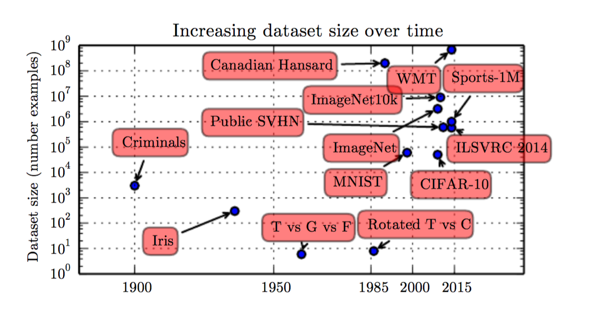
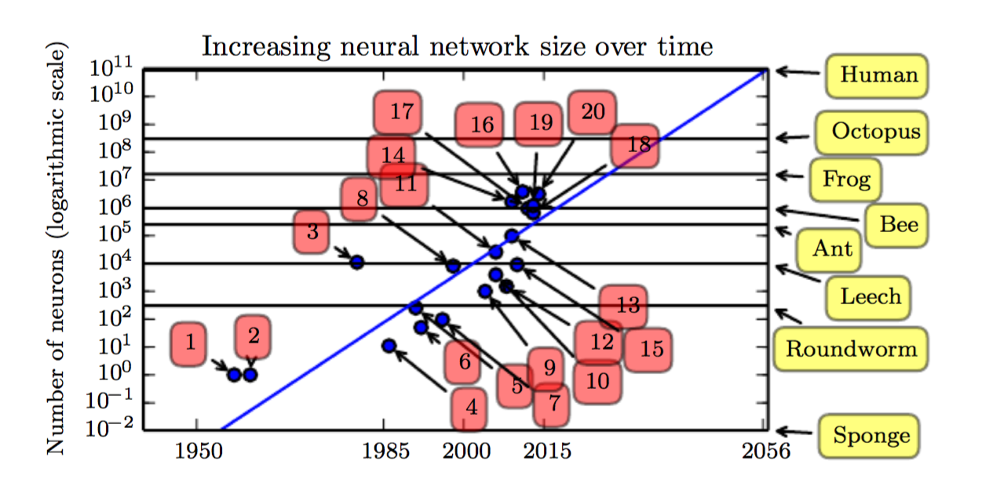

#从alphgo说起
最近非常火的人工智能就是alphgo了。
>2015年10月，它成为第一个无需让子，即可在19路棋盘上击败围棋职业棋手的电脑围棋程序。2016年3月，在一场五番棋比赛中，AlphaGo于前三局以及最后一局均击败顶尖职业棋手李世石，成为第一个不借助让子而击败围棋职业九段棋手的电脑围棋程序。五局赛后韩国棋院授予AlphaGo为有史以来第一位名誉职业九段。2016年7月18日，根据积分，Go Ratings网站将AlphaGo列为世界围棋排名第一。 2016年12月29日至2017年1月4日，AlphaGo以“Master”为账号名称，在未公开其真实身份的情况下，借非正式的网络快棋对战进行测试，挑战中韩日台的顶尖高手，其惊人的棋力轰动棋坛，测试结束时60战全胜。\[[1](#参考文献)\]   

他给我们震动很大的原因有两个方面:

 * 一方面是他取得的成就：历史上，由于围棋巨大的搜索空间，我们一般认为程序在这个领域战胜人类是非常困难的。\[[1](#参考文献)\] 
 * 另外一方面是他的训练方法：他是自己跟自己下棋，从中找到规律，而不是从人类的棋谱中学习。虽然在与李世石下棋的过程中会出现人一般意义上认为的臭棋，但是alphgo在自己与自己下棋的过程中，探索除了一套"组合拳", 在整体上打败了李世石。证明了alphgo自己穷举性的探索实际比人类几个世纪在在围棋上的的探索更加的细致和有效。

在alphgo背后的是alphgo的计算的问题：   
然后，从这个例子，我们可能就会考虑到几个问题：  

 * 我们需要这么大的计算量吗？毕竟alphgo只是一个研究性的项目
 * 如果我们需要这么大的计算量，我们应该怎么做？  

#传统的机器学习
#深度学习
##深度学习解决的问题
##深度学习的趋势
###与日递增的数据规模\[[2](#参考文献)\]

 
图1. 数据集合的增长趋势

  

###与日递增的神经网络规模\[[2](#参考文献)\]

 
图2. 神经网络规模的增长趋势\[[2](#参考文献)\]

#通用计算集群的重要性
##hpc
##Mesos和Yarn类的framwork
##kubernets
###处理任务依赖
###AI计算的全生命周期
###集群利用率
 
# 总结
## kubernets改变了生态环境

# 参考文献
1.["https://zh.wikipedia.org/wiki/AlphaGo"](https://zh.wikipedia.org/wiki/AlphaGo)  
2.["https://www.deeplearningbook.org"](https://www.deeplearningbook.org/)  
3.王益.["基于Kubernetes构建AI业务生态"](http://www.infoq.com/cn/presentations/building-ai-business-ecosystem-based-on-kubernetes?utm_source=infoq&utm_campaign=user_page&utm_medium=link)